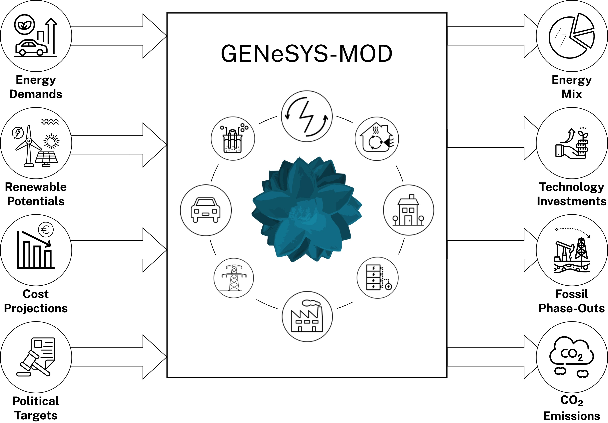

# GENeSYS-MOD – The Global Energy System Model

## 📚 Documentation & Overview

**GENeSYS-MOD** (The Global Energy System Model) is an open-source, cross-sectoral energy system model developed to analyze long-term energy transitions. It is based on [OSeMOSYS](http://www.osemosys.org/) but has been significantly extended with new features, input structures, and sectoral linkages.

GENeSYS-MOD supports scenario analysis from national to global levels and covers electricity, transport, buildings, and industry sectors. Implementations are available in both **Julia** and **GAMS**, and the model is designed for usability even on standard laptops.

- 📖 https://genesysmod.readthedocs.io/
- 🛠️ Programming Languages: Julia 
- 📜 License: Apache 2.0

---

## 🧠 Model Highlights

GENeSYS-MOD includes the following key capabilities:

1. **Cross-sectoral energy modeling** – Integrates electricity, transport, buildings, and industry.
2. **Interregional energy trade** – Supports trading between user-defined regions.
3. **Open and flexible input structure** – Fully transparent and modifiable datasets.
4. **IAMC-compatible output** – Exports results in the [IAMC format](https://github.com/IAMconsortium) for use in intercomparison studies and dashboards.

🔠Simplified structure of GENeSYS-MOD sectoral coverage.

---

## 🧱 Model Architecture

GENeSYS-MOD is a **linear optimization model** that minimizes total system costs subject to technical, environmental, and policy constraints. Key features include:

- Flexible **temporal and spatial resolution**
- **Demand-driven capacity expansion**
- **Energy balance constraints** for all fuels and sectors
- **Technology-specific availability and capacity factors**
- Support for **renewables, storage, and sector coupling**
