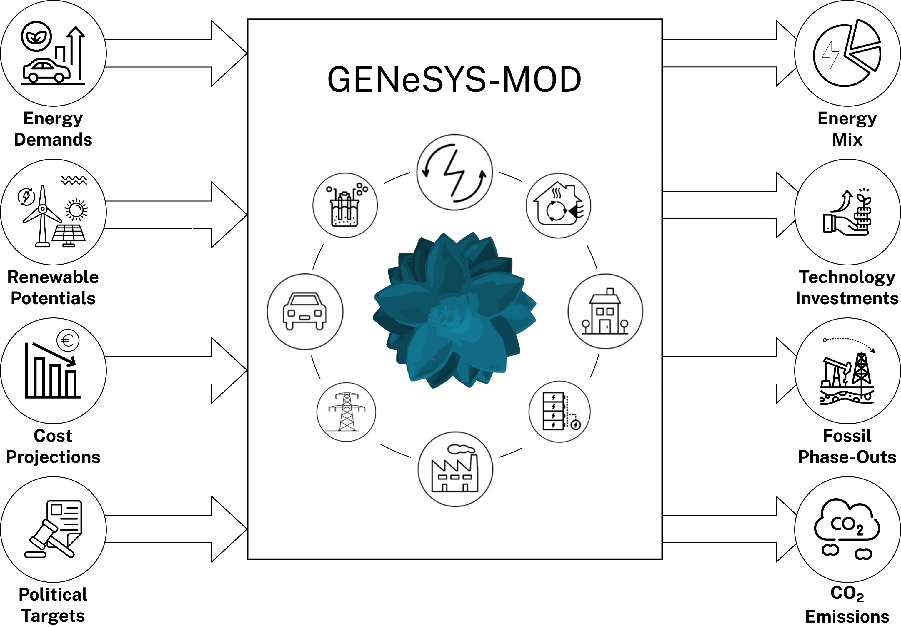

# GENeSYS-MOD – Le Modèle Énergétique Global

## 📚 Documentation & Présentation

**GENeSYS-MOD** (Le Modèle Énergétique Global) est un modèle open-source et intersectoriel développé pour analyser les transitions énergétiques à long terme. Il est basé sur [OSeMOSYS](http://www.osemosys.org/) mais a été considérablement étendu avec de nouvelles fonctionnalités, structures d'entrée et liaisons sectorielles.

GENeSYS-MOD prend en charge l'analyse de scénarios du niveau national au niveau mondial et couvre les secteurs de l'électricité, du transport, du bâtiment et de l'industrie. Des implémentations sont disponibles en **Julia** et **GAMS**, et le modèle est conçu pour être utilisable même sur des ordinateurs portables standards.

- 📖 https://github.com/GENeSYS-MOD & https://genesysmod.readthedocs.io/
- 🛠️ Langage de programmation : Julia
- 📜 Licence : Apache 2.0

---

## 🧠 Points Forts du Modèle

GENeSYS-MOD comprend les capacités clés suivantes :

1. **Modélisation énergétique intersectorielle** – Intègre les secteurs de l'électricité, du transport, du bâtiment et de l'industrie.
2. **Commerce énergétique interrégional** – Prise en charge des échanges entre régions définies par l'utilisateur.
3. **Structure d'entrée ouverte et flexible** – Jeux de données entièrement transparents et modifiables.
4. **Sortie compatible IAMC** – Exportation des résultats au format [IAMC](https://github.com/IAMconsortium) pour des études comparatives et des tableaux de bord.

🔁 Structure simplifiée de la couverture sectorielle de GENeSYS-MOD.

---

## 🧱 Architecture du Modèle

GENeSYS-MOD est un **modèle d'optimisation linéaire** qui minimise les coûts totaux du système sous contraintes techniques, environnementales et politiques. Les principales caractéristiques incluent :

- Résolution **temporelle et spatiale** flexible
- **Extension de capacité basée sur la demande**
- Contraintes de **bilan énergétique** pour tous les carburants et secteurs
- Facteurs de disponibilité et de capacité **spécifiques à chaque technologie**
- Prise en charge des **renouvelables, du stockage et du couplage sectoriel**
